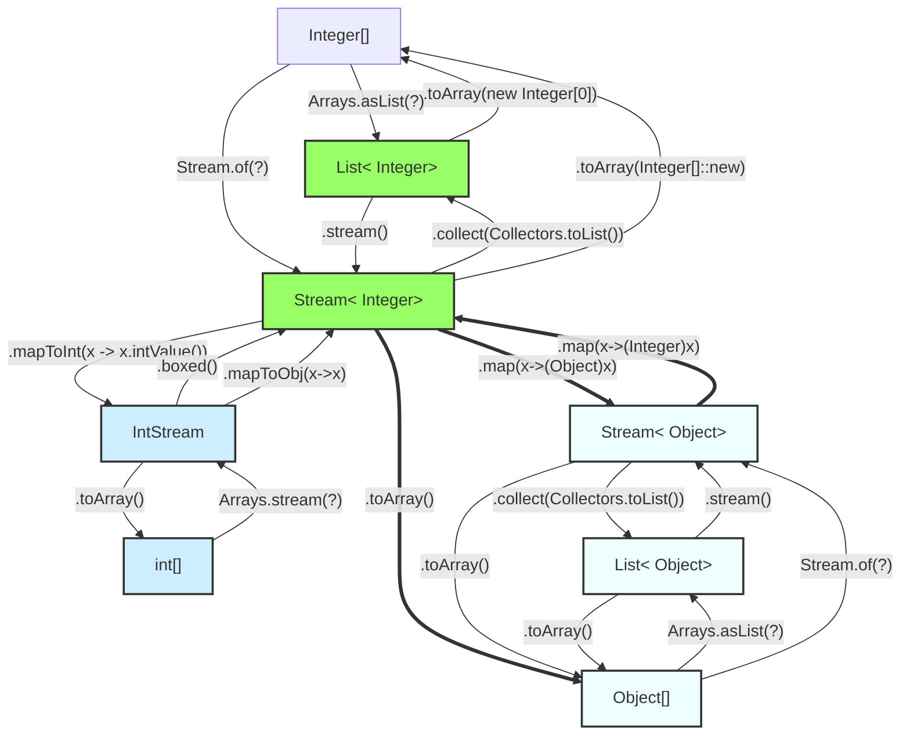

# Stream - I
## by Kevin Wong

```mermaid
graph TD
ia["Integer[]"]
li[List< Integer>]
si[Stream< Integer>]
inta["int[]"]
ints["IntStream"]
so[Stream< Object>]
lo[List< Object>]
oa["Object[]"]


si --> |".mapToInt(x -> x.intValue())"| ints
ints --> |".toArray()"| inta
ints --> |".boxed()"| si
ints --> |".mapToObj(x->x)"| si
inta --> |"Arrays.stream(?)"| ints

so ==> |".map(x->(Integer)x)"| si
si ==> |".map(x->(Object)x)"| so

li --> |".toArray(new Integer[0])"| ia
si --> |".collect(Collectors.toList())"| li
ia --> |"Arrays.asList(?)"| li
ia --> |"Stream.of(?)" | si
si --> |".toArray(Integer[]::new)"| ia
li --> |".stream()"| si

si ==> |".toArray()"| oa

lo --> |".stream()"| so
so --> |".collect(Collectors.toList())"| lo
oa --> |"Arrays.asList(?)"| lo
so --> |".toArray()"| oa
oa --> |"Stream.of(?)" | so
lo --> |".toArray()"| oa

classDef green fill:#9f6,stroke:#333,stroke-width:2px;
classDef lgreen fill:#eff,stroke:#333,stroke-width:2px;
classDef lblue fill:#cef,stroke:#333,stroke-width:2px;
class si,li green
class so,lo,oa lgreen
class inta,ints lblue
```